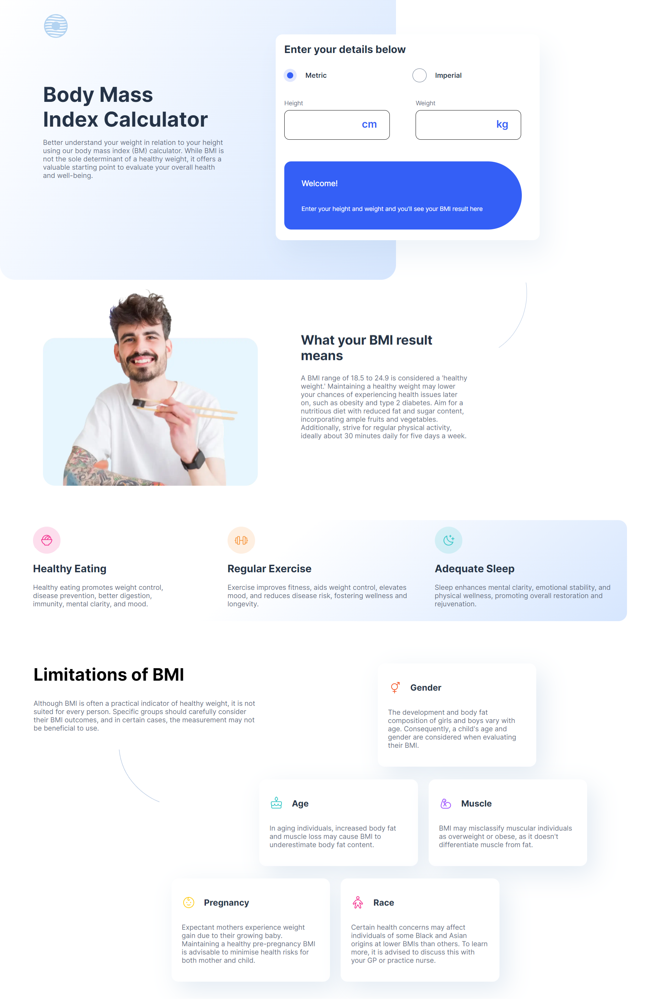

## Welcome! 👋

This is a solution to the [Body Mass Index Calculator challenge on Frontend Mentor](https://www.frontendmentor.io/challenges/body-mass-index-calculator-brrBkfSz1T).

### Screenshot

**Desktop version of the final product**

### Links

-   Solution URL: [Frontend Mentor Challenge](https://www.frontendmentor.io/solutions/bmi-index-calculator-AbTmDM9OY3)
-   Live Site URL: [Live Site URL](https://joshhovis.github.io/BMI-Calculator/)

### Built with

-   Figma design files
-   Semantic HTML5 markup
-   CSS custom properties
-   Flexbox
-   Mobile-first workflow

## Author

-   Website - [GitHub](https://github.com/joshhovis)
-   LinkedIn - [LinkedIn](https://www.linkedin.com/in/joshua-hovis/)
-   Frontend Mentor - [@joshhovis](https://www.frontendmentor.io/profile/joshhovis)
